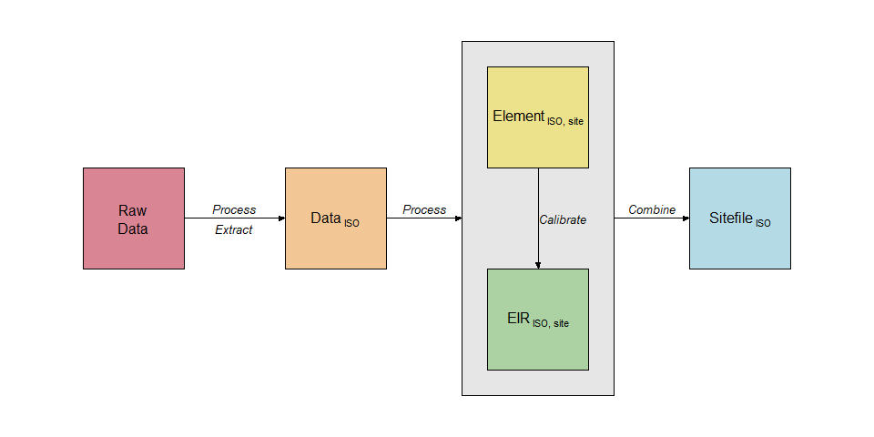

<!-- README.md is generated from README.Rmd. Please edit that file -->

# foresite-orderly

An orderly2 implementation of malaria site files for the
[malariaverse](https://mrc-ide.github.io/malariaverse/).

# Structure

Use `mission_control.R` to define parameters and run site file creation.
Individual countries or site-file elements can be run and re-run in
isolation using this script.

The site file create process has the following steps:

<!-- -->
