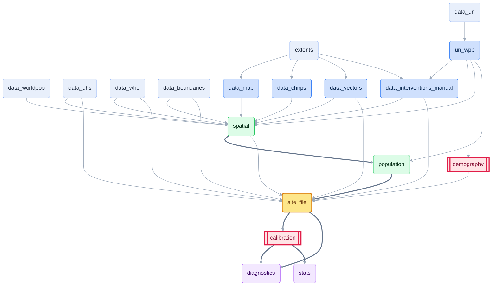

# foresite-orderly

`foresite-orderly` is the **back-end pipeline** that builds, calibrates and
diagnoses malaria **site files** for the malariaverse. Site files are the
standardised, per-country input data structure consumed by the front-end
[`site`](https://mrc-ide.github.io/site/) package, which in turn parameterises the
[`malariasimulation`](https://mrc-ide.github.io/malariasimulation/) transmission
model.

The pipeline collates a large amount of raw global data (rasters, demography,
burden, interventions, vectors, rainfall), fuses it against administrative boundary
files, assembles a site file per country, calibrates the transmission intensity of
each site to observed prevalence, produces diagnostics, and publishes the finished
packets to a hosting server.

This document is aimed at someone taking over maintenance of the pipeline. It
assumes working familiarity with the [`orderly`](https://mrc-ide.github.io/orderly/)
workflow framework and the DIDE / [`hipercow`](https://mrc-ide.github.io/hipercow/)
HPC cluster, and links out to their documentation rather than re-explaining them.

> **Data-source metadata lives elsewhere.** The authoritative catalogue of *what*
> each dataset is, where it comes from, its version and access date is maintained on
> the user-facing
> [site data sources page](https://mrc-ide.github.io/site/articles/data_sources.html).
> This document deliberately does **not** duplicate that; it stays at the level of
> *which pipeline step feeds which category* and *how the pipeline is run*.

---

## Contents

1. [Overview](#1-overview)
2. [Prerequisites & access](#2-prerequisites--access)
3. [Repository layout](#3-repository-layout)
4. [The pipeline](#4-the-pipeline)
5. [Data sources (operational view)](#5-data-sources-operational-view)
6. [Running the pipeline](#6-running-the-pipeline)
7. [HPC execution](#7-hpc-execution)
8. [Calibration](#8-calibration)
9. [The site file (the end product)](#9-the-site-file-the-end-product)
10. [Diagnostics & QA](#10-diagnostics--qa)
11. [Releasing site files (packit)](#11-releasing-site-files-packit)
12. [Known issues / tech debt](#12-known-issues--tech-debt)
13. [Code conventions](#13-code-conventions)
14. [Package glossary](#14-package-glossary)
15. [Links](#15-links)

---

## 1. Overview

The end product is a **calibrated site file per country**, built for a chosen
combination of:

- a **boundary set** (e.g. `GADM_4.1.0`),
- an **admin level** (spatial resolution: 0 / 1 / 2 / 3),
- an **urban/rural split** (on or off),
- a **version** tag (e.g. `malariaverse_06_2026`).

Everything is orchestrated by a single top-level script,
[`mission_control.R`](mission_control.R), which runs the reports in dependency order
and dispatches the two heavy steps to the HPC cluster. Individual countries or
individual site-file elements can be (re-)run in isolation with the same script, as
long as their upstream packets already exist.

The framework is the merged **`orderly`** package (`orderly_config.json` pins
`minimum_orderly_version: 1.99.90`). Each report's entrypoint is
`src/<report>/<report>.R` — there are no `orderly.yml` files.

At a conceptual level the flow is:

```mermaid
flowchart LR
  raw["Raw data"] --> proc["Processed data (per country)"]
  proc --> elem["Site-file elements"]
  elem --> site["Site file (per country)"]
  site --> cal["Calibrated site file"]
  cal --> out["Diagnostics and release"]
```

---

## 2. Prerequisites & access

To run the full pipeline you need:

| Requirement | Detail |
|---|---|
| **R toolchain** | R + the package stack below. |
| **mrc-ide package stack** | Installed by [`provision.R`](provision.R). The mrc-ide packages (`site`, `netz`, `postie`, `malariasimulation`, `cali`, `scene`, `peeps`) are installed from GitHub via `remotes` and track their **default branch**; the remainder are CRAN packages (`orderly`, `sf`, `dplyr`, `ggplot2`, `knitr`, `rmarkdown`, `quarto`). |
| **DIDE cluster account** | The two heavy steps (`demography`, `calibration`) run on the Imperial DIDE **Windows** cluster via `hipercow` (driver `dide-windows`). See [§7](#7-hpc-execution). |
| **DIDE network share** | The project must live on the DIDE network share — the **malaria drive** (`\\projects.dide.ic.ac.uk\malaria`), mapped locally as the **`P:` drive** — so the cluster nodes can see the orderly root. The maintained, fully-populated copy (including all the large raw-data and boundary inputs that are absent from a git clone) lives in Pete's directory at `\\projects.dide.ic.ac.uk\malaria\pete\foresite-orderly`, i.e. `P://Pete/foresite-orderly` — the commented `setwd(...)` in `mission_control.R:21`. |
| **`GITHUB_PAT`** | Required only for publishing to packit ([§11](#11-releasing-site-files-packit)). A GitHub Personal Access Token with the **`read:org`** scope, stored in `.Renviron`. This is the only secret the codebase uses. |
| **Raw inputs** | Raw data and boundary files are **gitignored and absent from a clone** — they must be supplied locally before a run (see [§3](#3-repository-layout) and [§5](#5-data-sources-operational-view)). |

There are no other credentials, API keys or `Sys.getenv`/`Sys.setenv` calls in the
codebase; the data-download scripts hit public endpoints unauthenticated.

---

## 3. Repository layout

| Path | Role |
|---|---|
| [`mission_control.R`](mission_control.R) | **Master orchestrator.** Defines the ISO list, configures the cluster, and runs every report in dependency order (local + HPC). Start here. |
| [`provision.R`](provision.R) | Package install list used to build the R environment (locally and on the cluster). |
| [`orderly_config.json`](orderly_config.json) | Orderly root marker (`{"minimum_orderly_version":"1.99.90"}`). |
| `src/` | The **18 orderly reports** (see [§4](#4-the-pipeline)). |
| `shared/utils.R` | Shared resource (raster helpers + all diagnostic plotting functions), pulled into reports via `orderly::orderly_shared_resource("utils.R")` (used by `data_map`, `data_chirps`, `data_vectors`, `data_interventions_manual`, `site_file`, `diagnostics`). |
| `operations/push_packit.R` | Publishes a calibration packet (and its dependency tree) to the packit server. |
| `operations/extract_files.R` | Stop-gap: copies named artefacts out of the archive for ad-hoc distribution. |
| `README.md` | This documentation — the repo's single, hand-edited Markdown entry point. |
| `release_log.csv` | One-line-per-release notes. |
| `.gitignore` | Ignores orderly internals (`.outpack/`, `draft/`, `archive/`, `orderly_envir.yml`) and local-only dirs (`data/`, `hipercow/`, `operations/extracted/`, `backup/`, …). |

**Not in the repo (must exist locally before a run):**

- Raw inputs under `src/<report>/data/` — every `data_*` report's `data/` folder is
  gitignored.
- Boundary files under `src/data_boundaries/boundaries/<boundary>/<ISO>/<ISO>_<level>.RDS`
  — gitignored. `mission_control.R` derives the whole run list from this folder, so
  it must be populated (e.g. for `GADM_4.1.0`) before the per-country phase will run.
  **Do not `orderly_cleanup` the `boundaries/` folder** (noted in `mission_control.R`).

> **Where to get these:** the maintained copy on the malaria drive
> (`\\projects.dide.ic.ac.uk\malaria\pete\foresite-orderly`, mapped to `P:`; see
> [§2](#2-prerequisites--access)) already holds every one of these inputs, fully
> populated. The path of least resistance is to run the pipeline from that copy rather
> than repopulating the data from scratch.

---

## 4. The pipeline

### Dependency graph

Nodes are orderly reports; an arrow runs **from a report to each report that depends
on it** (declared via `orderly_dependency`), so the graph reads top-to-bottom in build
order. **Bold arrows** trace the main build path
(`spatial → population → site_file → calibration → diagnostics`/`stats`); the thin grey
arrows are the supporting data inputs that fan into `spatial` and `site_file`. Node
colour marks the pipeline stage, and the two double-bordered red nodes (`demography`,
`calibration`) are the steps that run on the HPC cluster:

> 🟦 data get & prep &nbsp;·&nbsp; 🟩 per-country build &nbsp;·&nbsp; 🟨 assembled site file &nbsp;·&nbsp; 🟪 diagnostics & summaries &nbsp;·&nbsp; 🟥 HPC cluster step

```mermaid
%%{init: {'flowchart': {'curve': 'basis', 'rankSpacing': 55, 'nodeSpacing': 38}}}%%
flowchart TD
  classDef source fill:#e8effb,stroke:#93b4f5,color:#1e293b;
  classDef global fill:#cfe0fd,stroke:#3b82f6,color:#0c2a52;
  classDef hpc fill:#ffe4e6,stroke:#e11d48,stroke-width:3px,color:#881337;
  classDef country fill:#dcfce7,stroke:#22c55e,color:#052e16;
  classDef assembly fill:#fde68a,stroke:#d97706,stroke-width:2px,color:#713f12;
  classDef output fill:#f3e8ff,stroke:#a855f7,color:#3b0764;

  extents(extents):::source
  data_un(data_un):::source
  data_worldpop(data_worldpop):::source
  data_dhs(data_dhs):::source
  data_who(data_who):::source
  data_boundaries(data_boundaries):::source

  un_wpp(un_wpp):::global
  data_map(data_map):::global
  data_chirps(data_chirps):::global
  data_vectors(data_vectors):::global
  data_interventions_manual(data_interventions_manual):::global

  demography[[demography]]:::hpc
  calibration[[calibration]]:::hpc

  spatial(spatial):::country
  population(population):::country
  site_file(site_file):::assembly

  diagnostics(diagnostics):::output
  stats(stats):::output

  data_un --> un_wpp
  extents --> data_map
  extents --> data_chirps
  extents --> data_vectors
  extents --> data_interventions_manual
  un_wpp --> data_interventions_manual
  un_wpp --> demography
  data_worldpop --> spatial
  data_map --> spatial
  data_chirps --> spatial
  data_dhs --> spatial
  data_who --> spatial
  data_vectors --> spatial
  data_boundaries --> spatial
  data_interventions_manual --> spatial
  un_wpp --> spatial
  un_wpp --> population
  spatial --> population
  population --> site_file
  demography --> site_file
  data_dhs --> site_file
  data_who --> site_file
  data_vectors --> site_file
  data_boundaries --> site_file
  data_interventions_manual --> site_file
  spatial --> site_file
  site_file --> calibration
  site_file --> diagnostics
  calibration --> diagnostics
  calibration --> stats

  linkStyle default stroke:#9aa7b8,stroke-width:1.1px;
  linkStyle 17,18,26,27,28,29 stroke:#64748b,stroke-width:2.75px;
```

### Two phases

- **Phase 1 — global data get & prep** (run once per data refresh; not
  country-specific except `demography`): `extents`, `data_un`, `data_worldpop`,
  `data_dhs`, `data_who`, `un_wpp`, `demography` (per-ISO, HPC), `data_map`,
  `data_interventions_manual`, `data_chirps`, `data_vectors`.
- **Phase 2 — per-country build & calibrate**: `data_boundaries`, then per country
  `spatial` → `population` → `site_file` → `diagnostics` (pre-calibration) →
  `calibration` (HPC) → `diagnostics` (post-calibration), then `stats` across all
  countries.

### Run parameters

The reports are stitched together by **parameter-matched** dependency queries (e.g.
`latest(parameter:boundary == this:boundary && parameter:iso3c == this:iso3c)`), so
re-running one country in isolation is safe provided its upstream packets exist.

| Parameter | Meaning | Default in `mission_control.R` |
|---|---|---|
| `boundary` | Boundary set / provider | `"GADM_4.1.0"` |
| `iso3c` | ISO3 country code | looped over ~108 malaria-endemic ISOs |
| `admin_level` | Spatial resolution (0/1/2/3) | `1` |
| `urban_rural` | Split each admin unit into urban & rural (doubles the site count) | `TRUE` |
| `version` | Release tag, auto-built as `malariaverse_<MM_YYYY>` | date-derived |

### The 18 reports

**Tier 0 — entry points (no dependencies)**

| Report | Purpose | Params | Key artefacts |
|---|---|---|---|
| `extents` | Publishes hand-curated per-country bounding boxes used to clip rasters. | — | ships `extents.csv` (resource) |
| `data_un` | Publishes raw UN source files. | — | (resource `data/`) |
| `data_who` | Reshapes WHO World Malaria Report annex data. | — | `wmr_cases_deaths.csv`, `wmr_itns_distributed.csv`, `wmr_irs_people_protected.csv` (+ `.png`) |
| `data_dhs` | Publishes DHS-derived treatment fractions. | — | (resource `data/`) |
| `data_worldpop` | Resamples annual WorldPop population rasters to a common per-country grid. | — | `population/<iso>/population.tif` |
| `data_boundaries` | Publishes admin boundary RDS files for a boundary set; computes per-country extents. | `boundary` | boundary RDS files, `extents.rds` |

**Tier 1 — global processing**

| Report | Purpose | Deps | Key artefacts |
|---|---|---|---|
| `un_wpp` | Pre-processes the large UN WPP/WUP/UNICEF files into single-year age structure & urbanisation. | `data_un` | `un_wpp.rds`, `un_wup.rds`, `unicef_neonatal_mortality.rds` |
| `data_map` | Clips Malaria Atlas Project rasters to each country extent. | `extents` | `map/<iso>/*.tif` |
| `data_chirps` | Clips CHIRPS monthly rainfall rasters per country. | `extents` | `rainfall/<iso>/rainfall.tif` |
| `data_vectors` | Vector abundance/occurrence rasters + vector tables; refits pyrethroid resistance. | `extents` | `vectors/<iso>/*.tif`, `vectors/*.csv` |
| `data_interventions_manual` | Rasterises manually curated coverage (SMC, PMC, RTS,S, R21) and builds a vaccine-delivery table. | `extents`, `un_wpp` | `manual/<iso>/*.tif`, `vaccine_delivery.csv` |

**Tier 2 — demography (HPC)**

| Report | Purpose | Params / Deps | Key artefacts |
|---|---|---|---|
| `demography` | Adjusts UN mortality so a fixed-size model population reproduces the observed equilibrium age distribution (via `peeps`). | param `iso3c`; dep `un_wpp` | `adjusted_demography.rds` |

**Tier 3 — per-country spatial processing**

| Report | Purpose | Params / Deps | Key artefacts |
|---|---|---|---|
| `spatial` | Pixel-level data fusion: extracts every raster layer onto population pixels, links pixels to admin units, reconciles ITN/IRS coverage against WHO distribution numbers (via `netz`). | params `boundary`, `iso3c`; 9 deps (`un_wpp`, `data_map`, `data_interventions_manual`, `data_worldpop`, `data_chirps`, `data_dhs`, `data_who`, `data_vectors`, `data_boundaries`) | `spatial.rds` |
| `population` | Aggregates pixels to admin×urban/rural units, applies future urbanisation, scales to UN totals. | params `boundary`, `iso3c`; deps `un_wpp`, `spatial` | `population.rds`, `population_age.rds` |

**Tier 4 — assembly & calibration**

| Report | Purpose | Params / Deps | Key artefacts |
|---|---|---|---|
| `site_file` | Assembles the final site file object (see [§9](#9-the-site-file-the-end-product)). | 5 params; 8 deps (`demography`, `spatial`, `population`, `data_interventions_manual`, `data_boundaries`, `data_vectors`, `data_who`, `data_dhs`) | `site.rds` |
| `calibration` (HPC) | Calibrates baseline EIR per site to match MAP prevalence; computes WMR bias corrections (see [§8](#8-calibration)). | 5 params; dep `site_file` | `calibrated_scaled_site.rds`, `calibration_output_raw.rds`, `diagnostic_epi.rds`, `diagnostic_prev.rds`, `national_epi.rds` |

**Tier 5 — diagnostics & cross-country QA**

| Report | Purpose | Params / Deps | Key artefacts |
|---|---|---|---|
| `diagnostics` | Per-country multi-page PDF report. Run **twice** via the `calibration` flag (pre-calibration off `site_file`; post-calibration off `calibration`). | 5 params **+ `calibration`**; dep `site_file` (if `calibration = FALSE`) or `calibration` (if `TRUE`) | `diagnostic_report.pdf` |
| `stats` | Cross-country calibration summary (model vs MAP prevalence; model vs WHO incidence & mortality). | params `boundary`, `admin_level`, `urban_rural`, `version`; dep `calibration` (looped over all ISOs) | `calibration_summary.png`, `calibration_summary_unadjusted.png` |

---

## 5. Data sources (operational view)

**Provenance, versions and access dates are documented on the
[site data sources page](https://mrc-ide.github.io/site/articles/data_sources.html)** —
consult that for the "what / where from" of every dataset. The table below is only
the *operational* mapping a maintainer needs: which report feeds which category, and
**how the pipeline obtains each input**.

Reports flagged **auto** ship a companion `download_*.R` script (bundled as a
resource) that fetches raw inputs from public endpoints into the gitignored
`src/<report>/data/` folder — run it manually to (re)populate inputs before running
the report. Reports flagged **manual** rely on curated inputs placed in `data/` by
hand.

| Report | Feeds (site data-source category) | How obtained |
|---|---|---|
| `data_un` → `un_wpp` | Demography (population, urbanisation, neonatal mortality) | **manual** |
| `data_worldpop` | Demography (spatial population) | **auto** (`download_worldpop.R`) |
| `data_map` | Prevalence · Interventions · Access & healthcare · Blood disorders | **auto** (`download_map.R`) |
| `data_chirps` | Rainfall / seasonality | **auto** (`download_chirps.R`) |
| `data_vectors` | Vectors · Net products | **manual** |
| `data_who` | Burden (cases/deaths) · commodity distribution | **manual** |
| `data_dhs` | Interventions (treatment splits) | **manual** |
| `data_interventions_manual` | Interventions (SMC/PMC) · Vaccine status | **manual** |
| `data_boundaries` | Boundaries | **manual** (GADM RDS files placed on disk) |

`extents` is internal pipeline infrastructure (per-country bounding boxes for raster
clipping), shipped as a committed `extents.csv` — not an external dataset.

---

## 6. Running the pipeline

The canonical run is a top-to-bottom execution of [`mission_control.R`](mission_control.R).
Its sequence:

1. **Define the ISO list** — `malaria_endemic_isos` (~108 ISO3 codes).
2. **Configure the cluster** — `hipercow::hipercow_init()` +
   `hipercow_configure(driver = 'dide-windows')`. (First-time setup also runs
   `hipercow_provision()`; see [§7](#7-hpc-execution).)
3. **Global data layer (local)** — `extents`, `data_un`, `data_worldpop`,
   `data_dhs`, `data_who`, `un_wpp`.
4. **`demography` (HPC)** — one task per ISO, bundled and monitored.
5. **Remaining global data (local)** — `data_map`, `data_interventions_manual`,
   `data_chirps`, `data_vectors`.
6. **Set run options** — `boundary`, `admin`, `urban_rural`, `version`; derive
   `isos` from the boundaries folder, drop any ISO lacking the requested admin level,
   and compute `n_sites` per ISO (for calibration core requests).
7. **`data_boundaries` (local)** — publish the boundary set.
8. **Per-country build (local)** — loop `spatial` → `population` → `site_file` →
   `diagnostics(calibration = FALSE)`.
9. **`calibration` (HPC)** — one task per ISO (cores scaled to site count), bundled
   and monitored.
10. **Post-calibration diagnostics (local)** — loop `diagnostics(calibration = TRUE)`.
11. **`stats` (local)** — cross-country calibration summary.

**Local vs HPC:** everything runs locally with `orderly::orderly_run(...)` **except**
`demography` and `calibration`, which are dispatched to the cluster. A full local run
is impractical because of these two steps.

**Re-running one country:** call the relevant `orderly_run` with that ISO's
parameters. Because dependencies are parameter-matched, only that country's chain is
rebuilt, provided its upstream packets are present in the archive.

---

## 7. HPC execution

> Assumes familiarity with [`hipercow`](https://mrc-ide.github.io/hipercow/) and the
> DIDE cluster. This section covers only the project-specific details.

- **Driver:** `dide-windows` (the Imperial DIDE Windows cluster). Configuration is
  inline in `mission_control.R:20-26` — there is no separate cluster config file.
- **Network share:** the project must live on the DIDE **malaria drive**
  (`\\projects.dide.ic.ac.uk\malaria`, mapped to **`P:`**) so cluster nodes can reach
  the orderly root; the maintained copy is Pete's `...\malaria\pete\foresite-orderly`
  (`P://Pete/foresite-orderly`). This is the single most important undocumented
  prerequisite; its only trace in code is the commented `setwd(...)` at
  `mission_control.R:21`.
- **Provisioning:** run `hipercow::hipercow_provision()` once (it auto-detects
  [`provision.R`](provision.R)).
- **The two HPC steps:**
  - `demography` — one task per ISO, `hipercow_parallel("parallel")`, **16 cores**
    each, collected into a `Demography_<timestamp>` bundle.
  - `calibration` — one task per ISO, `hipercow_parallel("parallel")`, cores =
    `max(2, min(32, n_sites[iso]))` (scaled to the number of sites in the country),
    collected into a `Calibration_<timestamp>` bundle.
- **Two-level parallelism:** hipercow launches each report as one cluster task; inside
  the report the work fans out across the allocated cores with
  `parallel::makeCluster(...)` (over EIR rows in `calibration`, over demography groups
  in `demography`).
- **Monitoring:** `hipercow::hipercow_bundle_create()` /
  `hipercow_bundle_status()`; per-task `task_status()` / `task_log_show()` are handy
  when debugging.

---

## 8. Calibration

`calibration` is the only step that actually runs the transmission model. It fills in
the `eir` placeholders left in the site file.

- **What is calibrated:** the baseline **entomological inoculation rate (EIR)** for
  each site × species, tuned so modelled parasite prevalence matches the **Malaria
  Atlas Project** target — **PfPR₂₋₁₀** for *P. falciparum*, **PvPR** for *P. vivax* —
  averaged over **2010–2024**.
- **Method** (`src/calibration/calibration_utils.R::calibrate_site`):
  1. `site::subset_site` extracts a single site; the ITN input distribution is derived
     via `site::site_usage_to_model_distribution` + `netz`.
  2. `site::site_parameters(...)` builds the `malariasimulation` parameter list (with a
     calibration burn-in).
  3. `cali::calibrate` searches EIR (`eir_limits = c(1e-5, 1500)`, escalating
     `human_population`, capped `max_attempts`), using a summary function that runs the
     model and reads prevalence via `postie::drop_burnin` → `postie::get_prevalence`.
  4. A diagnostic run at `human_population = 50000` extracts prevalence and rates
     (`postie::get_prevalence` / `get_rates`).
- **Bias correction:** national modelled cases/deaths are compared to the WHO WMR to
  compute `case_bias_correction` / `death_bias_correction`, stored in
  `site$bias_correction`.
- **Key output:** `calibrated_scaled_site.rds` — the site file with EIR filled in and
  bias corrections attached. This is the packet that gets released.

Depends on the malariaverse model stack: `site`, `malariasimulation`, `cali`,
`postie`, `netz`.

---

## 9. The site file (the end product)

`src/site_file/site_file.R` assembles `site.rds`, a named list. Before saving it calls
`check_params()` to confirm every site can build a valid `malariasimulation`
parameter set, and guards against invalid data (no NA interventions; PAR ≤ population;
PAR_pf / PAR_pv ≤ PAR).

| Element | Content |
|---|---|
| `country`, `boundary`, `admin_level` | Identifiers |
| `metadata` | `country`, `iso3c`, `boundary`, `admin_level`, `version` |
| `sites` | Table of the unique site rows (admin × urban/rural units) |
| `shape` | `sf` polygons for each admin level |
| `cases_deaths` | WMR cases/deaths/PAR + derived incidence & mortality |
| `prevalence` | Population-weighted PfPR & PvPR per site-year |
| `interventions` | Nested: `treatment` (implementation, prop_public), `itn` (retention_half_life, use, implementation), `irs`, `smc` (drug, implementation), `pmc` (drug, age, implementation), `vaccine` (delivery, primary_schedule, booster_spacing, implementation), `lsm` |
| `population` | `population_total` and `population_by_age` |
| `demography` | Adjusted single-year mortality rates |
| `vectors` | `vector_species` (top-3 species proportions + bionomics) and `pyrethroid_resistance` |
| `seasonality` | `seasonality_parameters`, `monthly_rainfall`, `fourier_prediction`, `peak_season` |
| `blood_disorders` | Sickle-cell, G6PD, HbC, Duffy-negativity frequencies |
| `accessibility` | Motor / walking travel time to healthcare, travel time to city |
| `eir` | Per site × species rows with `eir = NA` — **placeholders filled by calibration** |

The `site` package is the authority on this structure and how it becomes model input.

---

## 10. Diagnostics & QA

- **`diagnostics`** → per-country `diagnostic_report.pdf`. Run **before** calibration
  (`calibration = FALSE`, off `site.rds`) and **after** (`calibration = TRUE`, off
  `calibrated_scaled_site.rds`). Contents include burden (cases / incidence / deaths /
  mortality, with model and bias-adjusted overlays), faceted intervention & prevalence
  maps, population age structure and urban/rural trends, accessibility and
  blood-disorder maps, and per-site pages (map, prevalence model-fit, interventions,
  vectors, resistance). Plot helpers live in `shared/utils.R`.
- **`stats`** → `calibration_summary.png` and `calibration_summary_unadjusted.png`:
  scatter plots (with identity line) of model vs MAP prevalence, model vs WHO
  incidence, and model vs WHO mortality across all countries. This is the headline
  cross-country check on calibration quality.

---

## 11. Releasing site files (packit)

Publishing is done from [`operations/push_packit.R`](operations/push_packit.R) using
[`packit`](https://github.com/mrc-ide/packit) via orderly's location helpers.

- **Active target:** location `packit.dide2` →
  `https://malariaverse-sitefiles.packit.dide.ic.ac.uk/`. (An older `packit.dide`
  path-style URL is present but guarded behind `add_new_location <- FALSE`; adding the
  location is a one-time step that "shouldn't need to be done again".)
- **Authentication:** a GitHub PAT in `GITHUB_PAT` (scope **`read:org`**), added to
  `.Renviron` via `usethis::edit_r_environ()`. orderly/packit read it implicitly.
- **What is pushed:** `orderly_location_push` sends a **single calibration packet plus
  its entire dependency tree** (site_file → spatial/population → the `data_*` reports),
  which includes large raster files. Pushes are therefore **per ISO**, not a single
  bulk sync. A `find_largest_file()` helper is included for debugging push size.
- **Ad-hoc distribution:** `operations/extract_files.R` is a stop-gap that copies named
  artefacts (the diagnostic PDF and the calibrated site file) out of the archive into
  `operations/extracted/<iso>/`.
- **Versioning:** the `version` string is auto-built from the date in
  `mission_control.R`, but it is **hard-coded** in `push_packit.R` and `extract_files.R`
  (both currently `malariaverse_06_2026`). These must be updated by hand to the release
  you intend to push. Record each release in [`release_log.csv`](release_log.csv).

---

## 12. Known issues / tech debt

One inherent caveat remains for the next maintainer:

- **`boundaries/` must not be cleaned.** The GADM RDS files under
  `src/data_boundaries/boundaries/<boundary>/` are large, hand-placed inputs — gitignored
  (so unrecoverable from git) and not regenerated by the pipeline — yet they also drive the
  run list (`isos <- list.files(...)` in `mission_control.R`). orderly does **not** protect
  them: because `data_boundaries` declares them as resources/artefacts via a computed
  `list.files()` value, orderly's *static* cleanup scan cannot see them and treats them as
  deletable, so a manual `orderly_cleanup("data_boundaries")` would wipe the boundary set
  and break every downstream per-country report. `mission_control.R` carries a prominent
  warning; if you ever need to clean, preview first with
  `orderly_cleanup_status("data_boundaries")` or `orderly_cleanup(..., dry_run = TRUE)`.
  The only structural fix would be to relocate the master copy outside `src/` (e.g. the
  top-level `shared/` tree), which cleanup never scans.

---

## 13. Code conventions

The R code here is **hand-formatted** — there is no `styler` / `air` / `lintr` step, so match
the surrounding style when editing. `.editorconfig` and `.gitattributes` enforce the whitespace
and line-ending rules automatically.

- **Indentation:** 2 spaces, never tabs.
- **Assignment:** `<-` (reserve `=` for named arguments inside a call, e.g. `list(x = 1)`).
- **Strings:** double quotes. **Pipes:** native `|>`. **Names:** `snake_case`.
- **Control flow (tight house style):** `if(cond){`, `for(x in y){`, `} else {`.
- **Function definitions:** `name <- function(args){`.
- **Sections:** delimit script sections with `# Title ----` banners closed by a `# ----` rule;
  each report opens with an `# Orderly set-up ----` block (parameters, resources, dependencies,
  artefacts).
- **Comments:** plain `#` explaining *why*, plus a one-line `#` description above each function.
  No roxygen (`#'`) — this is an orderly project, not a package.
- **Line endings / whitespace:** LF, UTF-8, a final newline, no trailing whitespace.
- **Namespacing:** existing `library()` vs `pkg::` usage is left as-is; don't refactor it.
- **orderly:** keep `orderly_*()` calls (parameters / resource / dependency / artefact) as
  top-level calls with literal-string arguments where they already sit — orderly parses them
  statically, so don't wrap those strings across lines or turn them into variables.

---

## 14. Package glossary

**malariaverse / domain packages**

| Package | Role in this pipeline |
|---|---|
| [`site`](https://mrc-ide.github.io/site/) | Defines the site-file structure and turns it into model inputs (`site_parameters`, `subset_site`, plotting helpers). Central to `site_file`, `calibration`, `diagnostics`. |
| [`malariasimulation`](https://mrc-ide.github.io/malariasimulation/) | The individual-based transmission model run during calibration. |
| [`cali`](https://github.com/mrc-ide/cali) | Calibration engine; maps EIR → prevalence. |
| [`postie`](https://github.com/mrc-ide/postie) | Post-processing of model output (`drop_burnin`, `get_prevalence`, `get_rates`). |
| [`netz`](https://github.com/mrc-ide/netz) | ITN net use ↔ access ↔ crop ↔ distribution conversions and net-loss functions. |
| [`umbrella`](https://github.com/mrc-ide/umbrella) | Seasonality: Fourier fit of rainfall → seasonal profile. |
| [`peeps`](https://github.com/mrc-ide/peeps) | Demography: mortality-rate estimation & equilibrium age distribution. |
| `malariaAtlas` | Downloads Malaria Atlas Project rasters (in `data_map`). |
| [`scene`](https://github.com/mrc-ide/scene) | Scenario / intervention futures (installed; not called directly in these reports). |

**Infrastructure / generic**

| Package | Role |
|---|---|
| [`orderly`](https://mrc-ide.github.io/orderly/) | The workflow framework itself. |
| [`hipercow`](https://mrc-ide.github.io/hipercow/) | HPC job submission to the DIDE cluster. |
| `terra`, `sf` | Raster and vector spatial processing. |
| `dplyr`, `tidyr`, `purrr`, `stringr` | Data wrangling. |
| `ggplot2`, `patchwork`, `qpdf` | Plotting and PDF assembly for diagnostics. |

---

## 15. Links

- orderly — <https://mrc-ide.github.io/orderly/>
- hipercow — <https://mrc-ide.github.io/hipercow/>
- packit — <https://github.com/mrc-ide/packit>
- site (front end) — <https://mrc-ide.github.io/site/>
- site data sources (dataset catalogue) — <https://mrc-ide.github.io/site/articles/data_sources.html>
- malariaverse — <https://mrc-ide.github.io/malariaverse/>
- malariasimulation — <https://mrc-ide.github.io/malariasimulation/>
